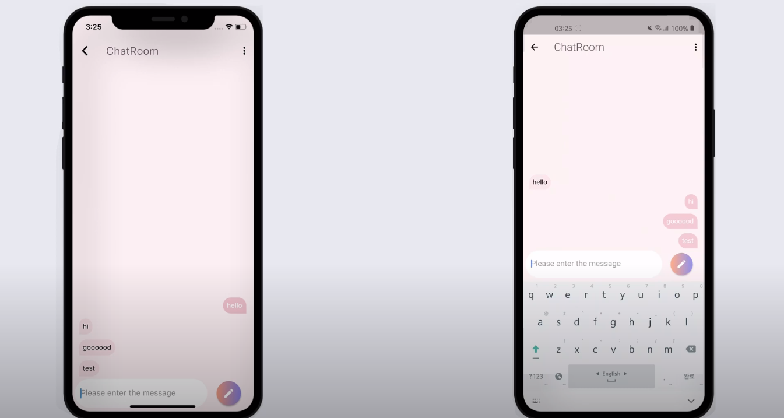
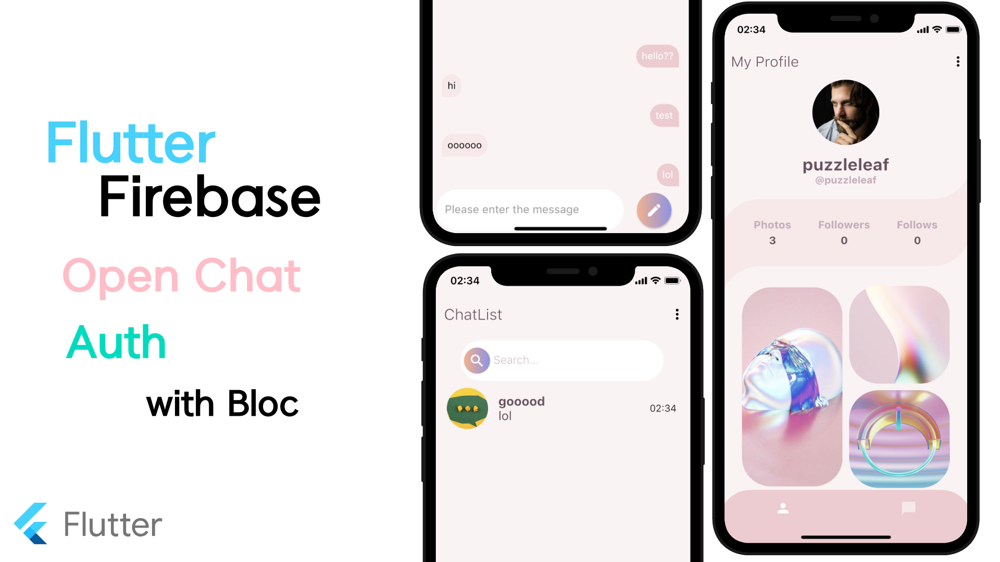

# Flutter Firebase Auth With Bloc (Login, Register)

### Youtube
https://youtu.be/5H5XBzeqSyk

#### Link
Firebase Auth With Bloc   
https://www.youtube.com/watch?v=xGqMgHnDgb8

#### Reference
Design   
https://dribbble.com/shots/11001305-FREE-Social-Mobile-App-UI-Kit-Figma

▶Packages 

<b>flutter_bloc</b>    
A Flutter package that helps implement the BLoC pattern.   
https://pub.dev/packages/flutter_bloc   

<b>firebase_auth</b>   
A Flutter plugin to use the Firebase Authentication API.   
https://pub.dev/packages/firebase_auth   

<b>equatable</b>      
Simplify Equality Comparisons   
https://pub.dev/packages/equatable   

<b>get_it</b>   
This is a simple Service Locator   
https://pub.dev/packages/get_it   

<b>cloud_firestore</b>   
A Flutter plugin to use the Cloud Firestore API.   
https://pub.dev/packages/cloud_firestore   

<b>intl</b>   
Date/number formatting and parsing   
https://pub.dev/packages/intl   
